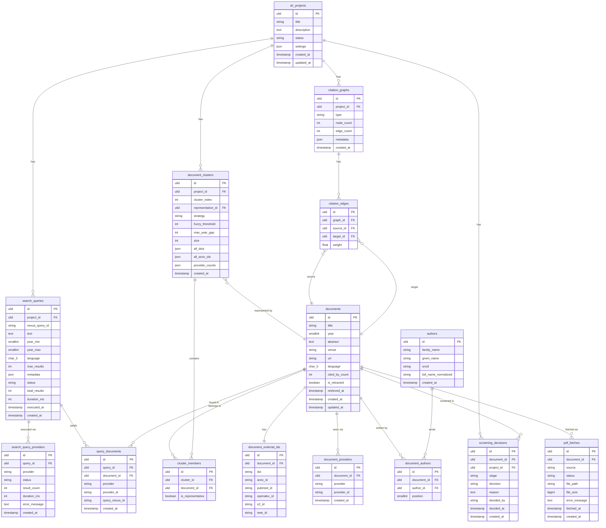

# nexus-php — Database Schema Design

**Package:** [nexus-scholar/nexus-php](https://github.com/nexus-scholar/nexus-php)
**Target:** Laravel migrations (MySQL 8+ / PostgreSQL 15+)

---

## Design Philosophy

The schema is designed around three principles:

1. **Immutable documents, mutable decisions.** A `Document` record represents a paper as retrieved from the API. What changes over a project's lifetime are *decisions about* the document (screening, clustering, PDF fetching). These are kept in separate tables so the source of truth is never overwritten.
2. **Cluster-aware deduplication.** The `document_clusters` and `cluster_members` tables persist the output of `ConservativeStrategy::deduplicate()`. This lets users see which raw documents were merged, which one was elected as representative, and re-run deduplication with different settings without losing the originals.
3. **Query provenance.** Every document is traceable back to the exact query and provider that surfaced it. This is a core SLR requirement for PRISMA reporting.

---

## Entity-Relationship Diagram



---

## Table-by-Table Design & Rationale

---

### `slr_projects`

```sql
CREATE TABLE slr_projects (
    id         CHAR(26) PRIMARY KEY,          -- ULID
    title      VARCHAR(255) NOT NULL,
    description TEXT,
    status     ENUM('active','archived','completed') DEFAULT 'active',
    settings   JSON,                           -- stores DeduplicationConfig, provider list, etc.
    created_at TIMESTAMP DEFAULT CURRENT_TIMESTAMP,
    updated_at TIMESTAMP DEFAULT CURRENT_TIMESTAMP ON UPDATE CURRENT_TIMESTAMP
);
```

**Why:** A top-level project scopes all queries, documents, and decisions. Without it, a user installing the package for multiple literature reviews would have no way to keep results separate. `settings` (JSON) stores the project-level `DeduplicationConfig`, enabled providers, and year range — mirroring `config.yml` but per-project in the database.

**Key decision — ULID over auto-increment:** ULIDs are lexicographically sortable, globally unique (safe for multi-tenancy), and URL-safe. Auto-increment leaks record counts to users and is unsafe to expose in APIs.

---

### `search_queries`

```sql
CREATE TABLE search_queries (
    id              CHAR(26) PRIMARY KEY,
    project_id      CHAR(26) NOT NULL REFERENCES slr_projects(id) ON DELETE CASCADE,
    nexus_query_id  VARCHAR(20),               -- the 'Q{uniqid}' from Query::$id
    text            TEXT NOT NULL,
    year_min        SMALLINT,
    year_max        SMALLINT,
    language        CHAR(5) DEFAULT 'en',
    max_results     INT,
    metadata        JSON,                       -- Query::$metadata (types, fields, etc.)
    status          ENUM('pending','running','completed','failed') DEFAULT 'pending',
    total_results   INT DEFAULT 0,
    duration_ms     INT,
    executed_at     TIMESTAMP NULL,
    created_at      TIMESTAMP DEFAULT CURRENT_TIMESTAMP,

    INDEX idx_project_status (project_id, status),
    INDEX idx_executed_at (executed_at)
);
```

**Why:** This table is the direct persistence of `Nexus\Models\Query`. It captures every field of the model so queries are reproducible — a researcher can re-run an identical search months later for PRISMA compliance.

**Key decision — `nexus_query_id`:** The package generates `Q{uniqid}` IDs at runtime and stamps them onto every `Document::$queryId`. Storing the mapping here lets you join a returned document's `queryId` back to the full query record.

**Key decision — `status` enum:** The `SearchJob` emits `SearchStarted` / `SearchCompleted` / `SearchFailed` events. This column is the persistent mirror of that job lifecycle, so the UI can show "2 of 7 providers done" without polling the cache.

---

### `search_query_providers`

```sql
CREATE TABLE search_query_providers (
    id            CHAR(26) PRIMARY KEY,
    query_id      CHAR(26) NOT NULL REFERENCES search_queries(id) ON DELETE CASCADE,
    provider      VARCHAR(30) NOT NULL,        -- 'openalex', 'arxiv', etc.
    status        ENUM('pending','searching','completed','failed') DEFAULT 'pending',
    result_count  INT DEFAULT 0,
    duration_ms   INT,
    error_message TEXT,
    created_at    TIMESTAMP DEFAULT CURRENT_TIMESTAMP,

    UNIQUE KEY uq_query_provider (query_id, provider)
);
```

**Why:** `SearchJob::handle()` already tracks per-provider progress in Redis/cache with `updateProviderProgress()`. This table makes that state durable. It is essential for PRISMA flow diagrams: "OpenAlex returned 312 records, arXiv returned 88 records, PubMed returned 45 records."

---

### `documents`

```sql
CREATE TABLE documents (
    id             CHAR(26) PRIMARY KEY,
    title          TEXT NOT NULL,
    year           SMALLINT,
    abstract       TEXT,
    venue          VARCHAR(512),
    url            VARCHAR(2048),
    language       CHAR(5),
    cited_by_count INT,
    is_retracted   BOOLEAN DEFAULT FALSE,
    retrieved_at   TIMESTAMP,
    created_at     TIMESTAMP DEFAULT CURRENT_TIMESTAMP,
    updated_at     TIMESTAMP DEFAULT CURRENT_TIMESTAMP ON UPDATE CURRENT_TIMESTAMP,

    FULLTEXT INDEX ft_title_abstract (title, abstract)  -- MySQL InnoDB fulltext
);
```

**Why:** This is the central entity. One row = one unique paper (post-deduplication representative). The full-text index on `(title, abstract)` supports the levenshtein-free fast-search that the UI will need when a user types a paper title to find it.

**Key decision — no `provider` column here:** A document is cross-provider by nature. Provider attribution lives in `document_providers` (the junction). Putting `provider` on `documents` would mean "the first provider to insert it wins", which is wrong.

**Key decision — `is_retracted`:** OpenAlex and Crossref both surface retraction status. Storing it here lets you filter retracted papers globally and show a warning badge — a safety-critical feature for evidence synthesis.

**Key decision — no `rawData` column:** The review (finding #10) flagged `rawData` as a memory risk. The DB schema enforces the opt-in design: raw JSON is *not* stored by default. If needed for debugging, add a `document_raw_snapshots` table behind a feature flag.

---

### `document_external_ids`

```sql
CREATE TABLE document_external_ids (
    id           CHAR(26) PRIMARY KEY,
    document_id  CHAR(26) NOT NULL REFERENCES documents(id) ON DELETE CASCADE,
    doi          VARCHAR(255),
    arxiv_id     VARCHAR(50),
    pubmed_id    VARCHAR(30),
    openalex_id  VARCHAR(30),
    s2_id        VARCHAR(50),
    ieee_id      VARCHAR(50),

    UNIQUE KEY uq_document (document_id),
    UNIQUE KEY uq_doi (doi),
    INDEX idx_arxiv (arxiv_id),
    INDEX idx_openalex (openalex_id),
    INDEX idx_s2 (s2_id)
);
```

**Why:** Mirrors `Nexus\Models\ExternalIds`. Separating IDs into their own table keeps the `documents` table narrow and allows efficient lookups by any identifier type — the deduplication engine needs to check "does a DOI already exist?" very fast.

**Key decision — `UNIQUE KEY uq_doi`:** DOI is a globally unique identifier. Enforcing uniqueness at the DB level prevents duplicate documents from slipping through if the application-level deduplication is bypassed (e.g., a direct insert). Note: allow `NULL` for DOI — many preprints and conference papers lack one.

---

### `document_providers`

```sql
CREATE TABLE document_providers (
    id          CHAR(26) PRIMARY KEY,
    document_id CHAR(26) NOT NULL REFERENCES documents(id) ON DELETE CASCADE,
    provider    VARCHAR(30) NOT NULL,
    provider_id VARCHAR(255) NOT NULL,         -- the provider's own ID for this paper
    created_at  TIMESTAMP DEFAULT CURRENT_TIMESTAMP,

    UNIQUE KEY uq_provider_record (provider, provider_id),
    INDEX idx_document (document_id)
);
```

**Why:** After deduplication, a single `Document` may have been seen by OpenAlex, Crossref, and Semantic Scholar — each with their own internal ID. This table stores all of them. It is the link between the deduplicated `documents` row and the raw provider records, enabling re-fetch or cross-reference.

---

### `authors` and `document_authors`

```sql
CREATE TABLE authors (
    id                   CHAR(26) PRIMARY KEY,
    family_name          VARCHAR(255) NOT NULL,
    given_name           VARCHAR(255),
    orcid                VARCHAR(30),           -- globally unique, enforced
    full_name_normalized VARCHAR(512),          -- lowercase, no diacritics — for dedup
    created_at           TIMESTAMP DEFAULT CURRENT_TIMESTAMP,

    UNIQUE KEY uq_orcid (orcid),
    INDEX idx_family_name (family_name)
);

CREATE TABLE document_authors (
    id          CHAR(26) PRIMARY KEY,
    document_id CHAR(26) NOT NULL REFERENCES documents(id) ON DELETE CASCADE,
    author_id   CHAR(26) NOT NULL REFERENCES authors(id),
    position    SMALLINT NOT NULL,              -- authorship order (1 = first author)

    UNIQUE KEY uq_document_author (document_id, author_id),
    INDEX idx_author (author_id)
);
```

**Why:** Authors are normalized into their own table rather than embedded as JSON. This enables queries like "find all papers by this author across all projects", which is impossible if authors are stored as `JSON` inside `documents`. `Nexus\Models\Author` has an `$orcid` field — ORCID is a globally unique researcher ID, so `UNIQUE KEY uq_orcid` prevents author duplication when two papers share an author.

**Key decision — `position` column:** First-author attribution matters in academia. Position 1 = first author, 2 = second, etc.

**Key decision — `full_name_normalized`:** A pre-computed normalized name (lowercase, diacritics stripped) enables fast author deduplication — "José García" and "jose garcia" are the same person. This is computed at insert time, not at query time.

---

### `query_documents`

```sql
CREATE TABLE query_documents (
    id             CHAR(26) PRIMARY KEY,
    query_id       CHAR(26) NOT NULL REFERENCES search_queries(id) ON DELETE CASCADE,
    document_id    CHAR(26) NOT NULL REFERENCES documents(id) ON DELETE CASCADE,
    provider       VARCHAR(30) NOT NULL,
    provider_id    VARCHAR(255),
    query_nexus_id VARCHAR(20),                -- matches Document::$queryId
    created_at     TIMESTAMP DEFAULT CURRENT_TIMESTAMP,

    UNIQUE KEY uq_query_document_provider (query_id, document_id, provider),
    INDEX idx_document (document_id),
    INDEX idx_query (query_id)
);
```

**Why:** This is the PRISMA provenance table. It records that document X was returned by query Y via provider Z. A document can appear in multiple queries (searched twice with different terms) and via multiple providers — this table captures all of those relationships without duplication of the document itself.

**Key decision — `UNIQUE KEY` on `(query_id, document_id, provider)`:** The same document can legitimately appear in the same query via two providers (e.g., OpenAlex and Crossref both return the same paper). The unique key allows this while preventing the exact same result from being recorded twice.

---

### `document_clusters` and `cluster_members`

```sql
CREATE TABLE document_clusters (
    id                CHAR(26) PRIMARY KEY,
    project_id        CHAR(26) NOT NULL REFERENCES slr_projects(id) ON DELETE CASCADE,
    cluster_index     INT NOT NULL,             -- the DocumentCluster::$clusterId
    representative_id CHAR(26) NOT NULL REFERENCES documents(id),
    strategy          VARCHAR(30) NOT NULL DEFAULT 'conservative',
    fuzzy_threshold   TINYINT NOT NULL DEFAULT 97,
    max_year_gap      TINYINT NOT NULL DEFAULT 1,
    size              SMALLINT NOT NULL DEFAULT 1,
    all_dois          JSON,
    all_arxiv_ids     JSON,
    provider_counts   JSON,
    created_at        TIMESTAMP DEFAULT CURRENT_TIMESTAMP,

    INDEX idx_project (project_id),
    INDEX idx_representative (representative_id)
);

CREATE TABLE cluster_members (
    id                CHAR(26) PRIMARY KEY,
    cluster_id        CHAR(26) NOT NULL REFERENCES document_clusters(id) ON DELETE CASCADE,
    document_id       CHAR(26) NOT NULL REFERENCES documents(id) ON DELETE CASCADE,
    is_representative BOOLEAN DEFAULT FALSE,

    UNIQUE KEY uq_cluster_member (cluster_id, document_id),
    INDEX idx_document (document_id)
);
```

**Why:** These two tables persist `Nexus\Models\DocumentCluster`. Storing the deduplication run with its parameters (`strategy`, `fuzzy_threshold`, `max_year_gap`) allows a researcher to re-run with different settings and compare results — a key requirement for systematic reviews.

**Key decision — `strategy` + parameters stored on cluster:** The dedup settings are immutable per run. Storing them here means "this cluster was formed with threshold=97, gap=1" is self-documenting — no need to join back to a settings table.

**Key decision — `is_representative` on `cluster_members`:** The representative is also a cluster member. Flagging it here makes it trivial to query "show me all non-representative duplicates of this paper" without a separate join through `document_clusters`.

---

### `screening_decisions`

```sql
CREATE TABLE screening_decisions (
    id          CHAR(26) PRIMARY KEY,
    document_id CHAR(26) NOT NULL REFERENCES documents(id) ON DELETE CASCADE,
    project_id  CHAR(26) NOT NULL REFERENCES slr_projects(id) ON DELETE CASCADE,
    stage       ENUM('title_abstract','full_text','final') NOT NULL,
    decision    ENUM('include','exclude','maybe','conflict') NOT NULL,
    reason      TEXT,
    decided_by  VARCHAR(255),                  -- user identifier or 'ai-agent'
    decided_at  TIMESTAMP NOT NULL,
    created_at  TIMESTAMP DEFAULT CURRENT_TIMESTAMP,

    INDEX idx_project_stage (project_id, stage),
    INDEX idx_document_project (document_id, project_id),
    INDEX idx_decision (decision)
);
```

**Why:** The SLR workflow has 2–3 screening stages. This table records each decision separately rather than updating a single `status` column on `documents`, for two reasons: (1) decisions are auditable — you can see who decided what and when; (2) a document may be excluded at title/abstract stage but later reconsidered (the history is preserved).

**Key decision — `decided_by VARCHAR` not a FK to users:** The package is installed into many apps with different auth systems. Using a string allows `decided_by` to hold a user UUID from the host app, an email address, or the string `'ai-agent'` (for the `LiteratureSearchAgent`), without coupling to any specific user model.

**Key decision — `'conflict'` as a decision value:** In multi-reviewer workflows, two reviewers may disagree. `conflict` flags the paper for a third-party arbitration pass rather than silently overwriting one decision with the other.

---

### `pdf_fetches`

```sql
CREATE TABLE pdf_fetches (
    id            CHAR(26) PRIMARY KEY,
    document_id   CHAR(26) NOT NULL REFERENCES documents(id) ON DELETE CASCADE,
    source        VARCHAR(30) NOT NULL,         -- 'arxiv', 'openalex', 'semantic_scholar', 'direct'
    status        ENUM('pending','success','failed','not_found') DEFAULT 'pending',
    file_path     VARCHAR(1024),
    file_size     BIGINT,
    error_message TEXT,
    fetched_at    TIMESTAMP NULL,
    created_at    TIMESTAMP DEFAULT CURRENT_TIMESTAMP,

    INDEX idx_document_status (document_id, status),
    INDEX idx_status (status)
);
```

**Why:** Mirrors `PDFFetcher::fetch()` output. Each attempt by each source is a separate row — this is important because `PDFFetcher` tries multiple sources in sequence and the first success wins. Storing all attempts tells the user "arXiv failed, OpenAlex succeeded" rather than just "PDF available".

**Key decision — separate `source` column:** The four sources in `PDFFetcher` (Direct, arXiv, SemanticScholar, OpenAlex) have different reliability profiles. Logging per-source allows analytics: "arXiv source succeeds 94% of the time, Direct source only 41%."

---

### `citation_graphs` and `citation_edges`

```sql
CREATE TABLE citation_graphs (
    id         CHAR(26) PRIMARY KEY,
    project_id CHAR(26) NOT NULL REFERENCES slr_projects(id) ON DELETE CASCADE,
    type       ENUM('citation','co_citation','bibliographic_coupling') NOT NULL,
    node_count INT DEFAULT 0,
    edge_count INT DEFAULT 0,
    metadata   JSON,                            -- PageRank scores, centrality, k-core params
    created_at TIMESTAMP DEFAULT CURRENT_TIMESTAMP,

    INDEX idx_project_type (project_id, type)
);

CREATE TABLE citation_edges (
    id        CHAR(26) PRIMARY KEY,
    graph_id  CHAR(26) NOT NULL REFERENCES citation_graphs(id) ON DELETE CASCADE,
    source_id CHAR(26) NOT NULL REFERENCES documents(id) ON DELETE CASCADE,
    target_id CHAR(26) NOT NULL REFERENCES documents(id) ON DELETE CASCADE,
    weight    FLOAT NOT NULL DEFAULT 1.0,

    UNIQUE KEY uq_edge (graph_id, source_id, target_id),
    INDEX idx_source (graph_id, source_id),
    INDEX idx_target (graph_id, target_id)
);
```

**Why:** The `CitationGraphBuilder` and `NetworkAnalyzer` produce in-memory `Graph` objects via `mbsoft31/graph-core`. This table persists the graph so it does not need to be rebuilt on every page load. `metadata` (JSON) stores computed metrics: PageRank scores, degree centrality, k-core results — the output of `NetworkAnalyzer`.

**Key decision — graph `type` enum, not a single table:** Citation graphs, co-citation graphs, and bibliographic coupling graphs are semantically different. Keeping them typed but in the same table (with `type`) avoids three near-identical table definitions while still allowing filtered queries ("show me only citation edges").

**Key decision — `weight FLOAT`:** Co-citation and bibliographic coupling edges carry a count-based weight (number of shared citing/referenced papers). Citation edges use weight=1.0. The same column serves both.

**Key decision — `metadata JSON` on `citation_graphs`:** PageRank scores are per-graph, not per-document. Storing them in a JSON blob on the graph row avoids a third `citation_graph_metrics` table for what is essentially a computed snapshot.

---

## Laravel Migration Order

Migrations must be created in this dependency order:

```
1. slr_projects
2. authors
3. documents
4. document_external_ids
5. document_providers
6. document_authors
7. search_queries
8. search_query_providers
9. query_documents
10. document_clusters
11. cluster_members
12. screening_decisions
13. pdf_fetches
14. citation_graphs
15. citation_edges
```

---

## Recommended Indexes Beyond the Migrations

For production deployments on large corpora (10k+ documents):

```sql
-- Fast lookup by DOI from SnowballService::buildIdSet()
CREATE INDEX idx_ext_doi ON document_external_ids (doi);

-- Fast author search by ORCID
CREATE INDEX idx_author_orcid ON authors (orcid);

-- Fast screening pipeline view: all unscreened included documents
CREATE INDEX idx_screening_stage_decision ON screening_decisions (project_id, stage, decision);

-- Fast citation edge traversal (both directions)
CREATE INDEX idx_edge_source ON citation_edges (source_id);
CREATE INDEX idx_edge_target ON citation_edges (target_id);
```

---

## What This Schema Does NOT Store (By Design)

| Omitted | Reason |
|---------|--------|
| `Document::$rawData` | Too large; opt-in only (see review finding #10) |
| User accounts / teams | Out of scope — the host app owns auth |
| Queue job records | Laravel's `jobs` table handles this natively |
| Cache entries | Redis/file cache handles transient state from `SearchJob` |
| Export file records | Export is stateless; files live on disk/S3, not in DB |
| Snowball run history | Can be modelled as a new `search_queries` row with `metadata.type = 'snowball'` |

